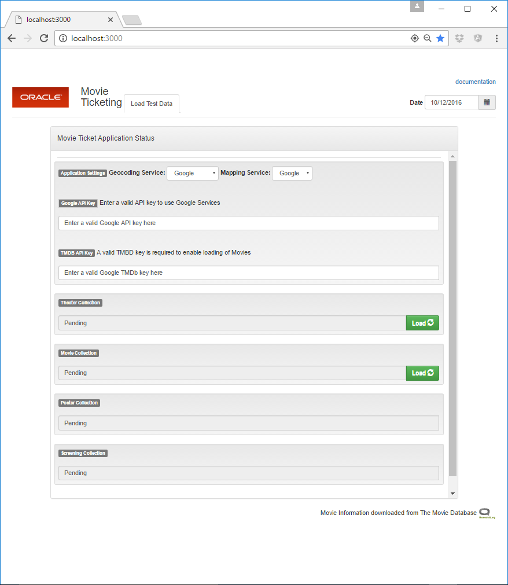
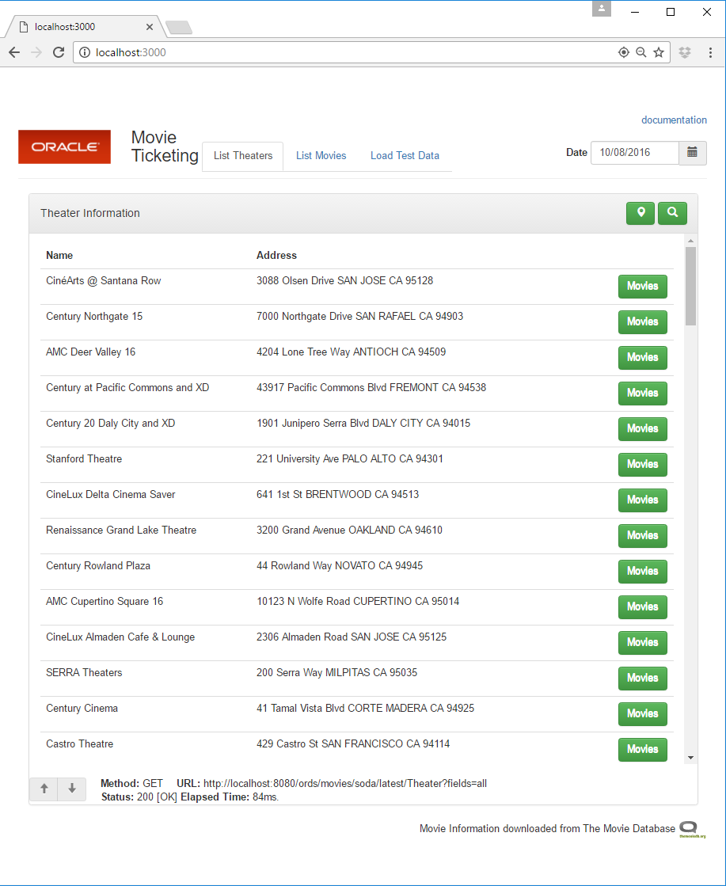

# Installation and Configuration

These instructions assume you already have access to an Oracle Database 12.1.0.2.0 instance with Bundle Patch 13 installed. If you do not have this available you can start by downloading the latest version of the [Oracle Developer Days VM](http://www.oracle.com/technetwork/database/enterprise-edition/databaseappdev-vm-161299.html) from the Oracle Technology Network. Although this VM comes with a version of Oracle Rest Data Services installed, you will need to update it from 3.0.4 to 3.0.5 by following step 1 of the instructions below

The MovieTicketing demonstration works with sample data downloaded from publically available websites. The THEATER collection is populated with data obtained from an RSS feed supplied by Fandango.com. This data is enriched with geocoding obtained from a geocoding service provided by the US Census bureau. The Movie and Poster collections are populated using data obtained from the website themoviedatabase.org (TMDb). In order to use data from TMDb you must register with the site and obtain an API key.

## 1\. Install and Configure Node.js

1.  Download [Node.js](https://nodejs.org/en/download/) from nodejs.org  

2.  Install Node.js  

    The following commands will work on Enterprise Linux, assuming the node installation tarball is in the users Downloads folder, for other environments please refer to the platform specific platform specific installation instructions at [https://docs.npmjs.com/getting-started/installing-node](https://docs.npmjs.com/getting-started/installing-node).

                    $ bash
                    $ cd
                    $ tar xf Downloads/node-v4.4.5-linux-x64.tar.xz 
                    $ export PATH=$PATH:~/node-v4.4.5-linux-x64/bin

3.  Use NPM to install the application and it's dependencies from GitHUB  

                    $ mkdir NodeExample
                    $ cd NodeExample
                    $ npm install oracle-movie-ticket-demo

    This should result in output similar to this:

                    oracle-movie-ticket-demo@1.0.0 node_modules/oracle-movie-ticket-demo
                    ├── angular-cookies@1.5.7
                    ├── cookie-parser@1.4.3 (cookie-signature@1.0.6, cookie@0.3.1)
                    ├── angular@1.5.7
                    ├── express-session@1.13.0 (utils-merge@1.0.0, cookie-signature@1.0.6, on-headers@1.0.1, cookie@0.2.3, parseurl@1.3.1, depd@1.1.0, crc@3.4.0,
                        uid-safe@2.0.0, debug@2.2.0)
                    ├── morgan@1.7.0 (on-headers@1.0.1, basic-auth@1.0.4, depd@1.1.0, debug@2.2.0, on-finished@2.3.0)
                    ├── serve-static@1.11.1 (escape-html@1.0.3, encodeurl@1.0.1, parseurl@1.3.1, send@0.14.1)
                    ├── body-parser@1.15.1 (content-type@1.0.2, bytes@2.3.0, depd@1.1.0, on-finished@2.3.0, qs@6.1.0, debug@2.2.0, raw-body@2.1.6, 
                        http-errors@1.4.0, iconv-lite@0.4.13, type-is@1.6.13)
                    ├── express@4.14.0 (escape-html@1.0.3, array-flatten@1.1.1, cookie-signature@1.0.6, utils-merge@1.0.0, encodeurl@1.0.1, merge-descriptors@1.0.1,
                        methods@1.1.2, content-type@1.0.2, parseurl@1.3.1, cookie@0.3.1, content-disposition@0.5.1, fresh@0.3.0, etag@1.7.0, range-parser@1.2.0, 
                        vary@1.1.0, path-to-regexp@0.1.7, depd@1.1.0, qs@6.2.0, on-finished@2.3.0, finalhandler@0.5.0, debug@2.2.0, proxy-addr@1.1.2, send@0.14.1, 
                        type-is@1.6.13, accepts@1.3.3)ffsdf
                    ├── jquery@2.2.4
                    ├── bootstrap@3.3.6
                    ├── bootstrap-datepicker@1.6.1
                    └── xml2js@0.4.16 (sax@1.2.1, xmlbuilder@4.2.1

    At this point the Node.js server has been installed and the application has been downloaded and is ready to run

## 2\. Install, configure and start Oracle Rest Data Services (ORDS)

1.  Download the latest version of [ORDS](http://www.oracle.com/technetwork/developer-tools/rest-data-services/downloads/index.html) from the Oracle Technology Network website  

2.  Install ORDS  

    The following commands will work on Enterprise Linux, assuming the node installation zip file is in the users Downloads folder, for other environments please refer to the platform specific installation instructions at [https://docs.oracle.com/cd/E37099_01/doc.20/e25066/toc.htm](https://docs.oracle.com/cd/E37099_01/doc.20/e25066/toc.htm).

                    $ cd
                    $ mkdir ORDS
                    $ cd ORDS
                    $ unzip ../Downloads/ords.3.0.5.124.10.54.zip 

    Make sure that the database and listener are started and you know a TNS Alias that can connect to the database where ORDS will be installed. Then start the ORDS configuration process as shown below

                    $ java -jar ords.war
                    This Oracle REST Data Services instance has not yet been configured.
                    Please complete the following prompts
                    Enter the location to store configuration data:/home/oracle/ORDS/config
                    Enter the name of the database server [localhost]:
                    Enter the database listen port [1521]:
                    Enter 1 to specify the database service name, or 2 to specify the database SID [1]:1
                    Enter the database service name:ORCL
                    Enter the database password for ORDS_PUBLIC_USER:
                    Confirm password:
                    Please login with SYSDBA privileges to verify Oracle REST Data Services schema.
                    Enter the username with SYSDBA privileges to verify the installation [SYS]:sys
                    Enter the database password for sys:
                    Confirm password:
                    Oracle REST Data Services will be installed in ORCL
                    Enter 1 if you want to use PL/SQL Gateway or 2 to skip this step.
                    If using Oracle Application Express or migrating from mod_plsql then you must enter 1 [1]:2

    At this point ORDS will be installed into the target database. The output will be as follows:

                    Jun 17, 2016 6:18:24 PM oracle.dbtools.common.config.file.ConfigurationFilesBase update
                    INFO: Updated configurations: defaults, apex_pu
                    Installing Oracle REST Data Services version 3.0.5.124.10.54
                    ... Log file written to /home/oracle/ORDS/logs/ords_install_core_2016-06-17_181824_00306.log
                    ... Verified database prerequisites
                    ... Created Oracle REST Data Services schema
                    ... Created Oracle REST Data Services proxy user
                    ... Granted privileges to Oracle REST Data Services
                    ... Created Oracle REST Data Services database objects
                    Completed installation for Oracle REST Data Services version 3.0.5.124.10.54\. Elapsed time: 00:00:14.299 
                    Enter 1 if you wish to start in standalone mode or 2 to exit [1]:2

    ORDS is now installed
3.  Create an ORDS user that has permissions to use SODA for REST  

                    java -jar ords.war user MovieTicketing "SODA Developer"
                    Enter a password for user MovieTicketing: 
                    Confirm password for user MovieTicketing: 
                    Jun 17, 2016 6:29:33 PM oracle.dbtools.standalone.ModifyUser execute
                    INFO: Created user: MovieTicketing in file: /home/oracle/ORDS/config/ords/credentials

4.  Increase the size of the ORDS JDBC connection pool  

    Edit the file defaults.xml. Assuming you specified /home/oracle/ORDS/config when responding to the prompt "Enter the location to store configuration data:" in step 2.1 the file is located in the folder config/ords. Locate the entry with the key "jdbc.MaxLimit" and change the value to 500\. Locate the entry with the key "jdbc.InitialLimit" and change the value to 50\. Save the file

5.  Start the ORDS Server  

    The first time you start the ORDS server you are asked whether you want to use HTTP or HTTPS and to select the port the server is to listen on. This information is only required the first time ORDS is started.

                    [oracle@localhost ORDS]$ java -jar ords.war standalone
                    Enter 1 if using HTTP or 2 if using HTTPS [1]:1
                    Enter the HTTP port [8080]:
                    2016-06-17 18:22:54.846:INFO::main: Logging initialized @5506ms
                    Jun 17, 2016 6:22:55 PM oracle.dbtools.standalone.StandaloneJetty setupDocRoot
                    INFO: Disabling document root because the specified folder does not exist: /home/oracle/ORDS/config/ords/standalone/doc_root
                    2016-06-17 18:22:55.994:INFO:oejs.Server:main: jetty-9.2.z-SNAPSHOT
                    Jun 17, 2016 6:22:56 PM oracle.dbtools.auth.crypto.CryptoKeysGenerator startup
                    INFO: No encryption key found in configuration, generating key
                    Jun 17, 2016 6:22:56 PM oracle.dbtools.auth.crypto.CryptoKeysGenerator startup
                    INFO: No mac key found in configuration, generating key
                    Jun 17, 2016 6:22:56 PM oracle.dbtools.common.config.file.ConfigurationFilesBase update
                    INFO: Updated configurations: defaults
                    Jun 17, 2016 6:22:56 PM oracle.dbtools.auth.crypto.CryptoKeysGenerator startup
                    INFO: Updated configuration with generated keys
                    2016-06-17 18:22:56.539:INFO:/ords:main: INFO: Using configuration folder: /home/oracle/ORDS/config/ords
                    2016-06-17 18:22:56.539:INFO:/ords:main: FINEST: |ApplicationContext [configurationFolder=/home/oracle/ORDS/config/ords, services=Application Scope]|
                    Jun 17, 2016 6:22:56 PM oracle.dbtools.common.config.db.DatabasePools validatePool
                    INFO: Validating pool: |apex|pu|
                    Jun 17, 2016 6:22:57 PM oracle.dbtools.common.config.db.DatabasePools validatePool
                    INFO: Pool: |apex|pu| is correctly configured
                    config.dir
                    2016-06-17 18:22:57.381:INFO:/ords:main: INFO: Oracle REST Data Services initialized|Oracle REST Data Services version : 3.0.5.124.10.54|Oracle REST Data Services server info: jetty/9.2.z-SNAPSHOT|
                    2016-06-17 18:22:57.384:INFO:oejsh.ContextHandler:main: Started o.e.j.s.ServletContextHandler@2d209079{/ords,null,AVAILABLE}
                    2016-06-17 18:22:57.410:INFO:oejs.ServerConnector:main: Started ServerConnector@2c8d66b2{HTTP/1.1}{0.0.0.0:8080}
                    2016-06-17 18:22:57.414:INFO:oejs.Server:main: Started @8085ms
                    ^C2016-06-17 18:28:39.476:INFO:oejs.ServerConnector:Thread-1: Stopped ServerConnector@2c8d66b2{HTTP/1.1}{0.0.0.0:8080}
                    2016-06-17 18:28:39.482:INFO:oejsh.ContextHandler:Thread-1: Stopped o.e.j.s.ServletContextHandler@2d209079{/ords,null,UNAVAILABLE}

    At this point the ORDS server is running and ready to service SODA for REST operations

## 3\. Create the Database Schema that will manage the MovieTickets document collections

1.  Connect to the database and execute the following commands  

                    $ sqlplus system@ORCL

                    SQL*Plus: Release 12.1.0.2.0 Production on Fri Jun 17 19:01:37 2016
                    Copyright (c) 1982, 2016, Oracle.  All rights reserved.

                    Enter password: 
                    Last Successful login time: Fri Jun 17 2016 18:14:03 -07:00

                    Connected to:
                    Oracle Database 12c Enterprise Edition Release 12.1.0.2.0 - 64bit Production

                    SQL> grant connect, resource, unlimited tablespace, SODA_APP to MOVIES identified by MOVIES;

                    Grant succeeded.

                    SQL> connect MOVIES/MOVIES@ORCL
                    Connected.
                    SQL> begin
                    2    ORDS.enable_schema();
                    3    commit;
                    4  end;
                    5  /

                    PL/SQL procedure successfully completed.

                    SQL> quit
                    Disconnected from Oracle Database 12c Enterprise Edition Release 12.1.0.2.0 - 64bit Production

    The SODA_APP role is required to use Oracle Document Collections. The call to ORDS.enable_schema() is required to allow the schema to be accessed via ORDS. Both steps are required to use SODA for REST.

## 4.Register for an account with themoviedatabase.org (TMDb)

1.  Register for a TMDb account by clicking [here](https://www.themoviedb.org/account/signup?language=en).
2.  Sign in to your account, click the API link in their left hand menu and follow the instructions to request an API key.
3.  Make a note of your API key.

## 5\. Update configuration files.

1.  config.json  

    The config.json file supplies the Node.js server with the information required to connect to the ORDS server. This file must be updated with the username and password and path to endpoint for the Movie Ticketing document store. Click the right arrow below to see a sample config.json document:

    The file is located in the folder NodeExample/node_modules/oracle-movie-ticket-sample The keys in this file are self explanatory

    *   **hostname:** The name or ipaddress of the machine hosting the ORDS instance
    *   **port:** The Port number the ORDS instance in listening on. This was specified the first time the ORDS instance was started (See step 2.4).
    *   **path:** The endpoint that provides access to the Movie Ticketing document store. The second component of this path is the database schema name (See step 3.1). The schema name is entered lowercase.
    *   **username & password** The user name and password used to authenticate with the ORDS server. Note this is the ORDS username and password from step 2.3, not the database schema name and password from step 3.1.  

2.  dataSources.json  

    If the application needs use a proxy server to connect to these sites information about the proxy server must be added to the dataSources.json file.

    Click the right arrow below to see a sample dataSources.json document:

    The file is located in the folder NodeExample/node_modules/oracle-movie-ticket-sample. The following keys may need to be edited before running the application.

    *   **useProxy:** Set to true if you need to use a proxy server to access external web sites.
    *   **proxy.hostname:** If a proxy server is required enter the hostname or ipaddress of the proxy server
    *   **proxy.port:** If a proxy server is required enter the port number used to communicate with the proxy server
    *   **tmdb.apiKey:** The API key for use with TMDb (See step 4).
    *   **movieStartDate & movieEndDate:** The application loads a small subset of the movies available on TMDb. Movies are selected based on release date. To get a current list of movies update these fields with appropriate values before loading the movie information.
    *   **theaterZipCode:** The zip code to use when obtaining a list of nearby theaters from Fandango

## 6\. Start the application

1.  Start Node.js server.  

    The following commands will work on Enterprise Linux, assuming you followed the steps outlined above.

                    $ cd
                    $ export PATH=$PATH:~/node-v4.4.5-linux-x64/bin
                    $ cd NodeExample/oracle-movie-ticket-demo
                    $ node index.js

    And the system should respond with something similar to this

                    MovieTicket Webserver listening on localhost:3000
                    Full Text Search Supported: false
                    Spatial Indexing Supported: false

## 7\. Access the application and load the test data

The application is configured to run on port 3000

1.  Open a browser and navigate to the application start page. You should see something similar to this:  

      

2.  Click the "Load Test Data" tab. You should see the following:  

      

3.  Click the "Load Theaters" button to download theater information from Fandango.
4.  Click the "Load Movies" button to download movie information from TMDb. This operation may take a while to complete due to throughput restrictions imposed by the TMDb website.
5.  Click the "Load Posters" button to download movie posters from TMDb. This operation is also subject to the throughput restrictions imposed by the TMDb website.
6.  Click the "Generate Screenings" button to generate 2 weeks' worth of screenings for the current set of theaters and movies.

Once all four operations have completed successfully the "Load Test Data" tab should look something like this:

  

The data loading process only needs to be completed once, since once data loading is completed all of the information needed to run the application is stored as JSON documents in the Oracle document store. If any of the steps fail, simply click the associated button to try the step again. Note you must successfully complete "Load Movies" before attempting to run "Load Posters", and you must successfully complete "Load Theaters" and "Load Movies" before attempting to run "Generate Screenings". If you re-run either "Load Theaters" or "Load Movies" you must re-run "Generate Screenings before attempting to use the movie ticketing application. If you re-run "Load Movies" you must also re-run "Load Posters" to repopulate the Posters collection.

Once the data loading process has been successfully completed you can simply refresh the page to start using the Application.
